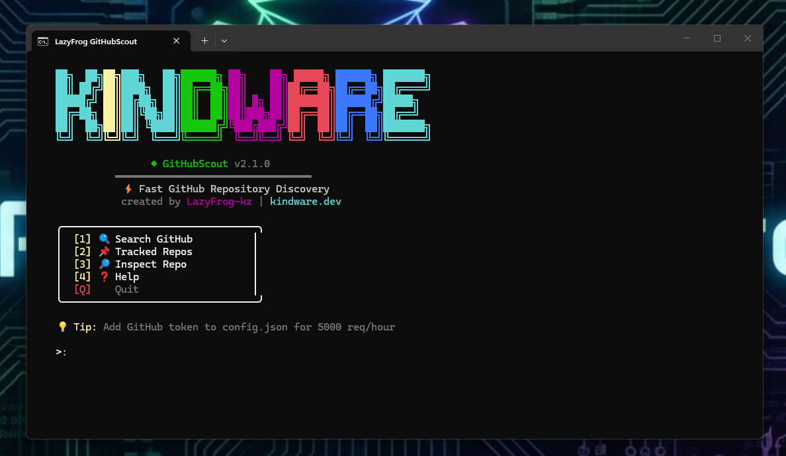
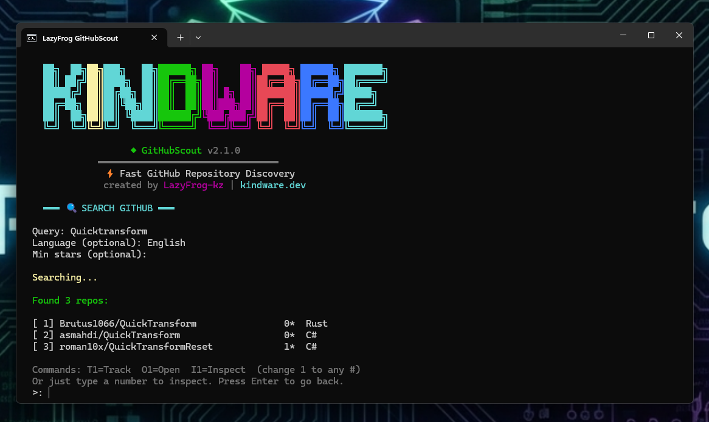
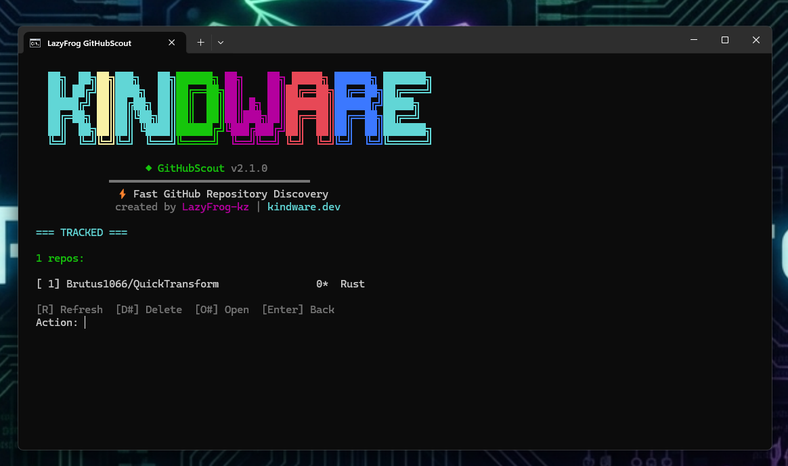
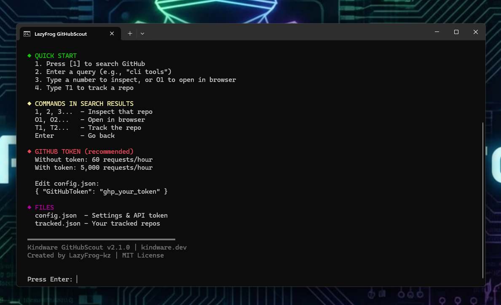
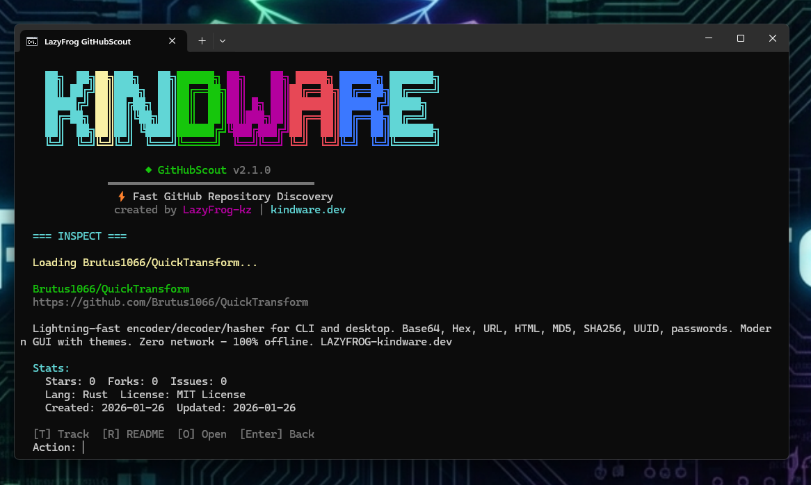

<p align="center">
  
  
  
  
  
</p>

<h1 align="center">⚡ GitHubScout</h1>

<p align="center">
  <strong>Lightning-fast CLI for GitHub Repository Discovery</strong>
</p>

<p align="center">
  <a href="#-features">Features</a> •
  <a href="#-screenshots">Screenshots</a> •
  <a href="#-installation">Installation</a> •
  <a href="#-usage">Usage</a> •
  <a href="#-commands">Commands</a>
</p>

```
    ██╗  ██╗██╗███╗   ██╗██████╗ ██╗    ██╗ █████╗ ██████╗ ███████╗
    ██║ ██╔╝██║████╗  ██║██╔══██╗██║    ██║██╔══██╗██╔══██╗██╔════╝
    █████╔╝ ██║██╔██╗ ██║██║  ██║██║ █╗ ██║███████║██████╔╝█████╗  
    ██╔═██╗ ██║██║╚██╗██║██║  ██║██║███╗██║██╔══██║██╔══██╗██╔══╝  
    ██║  ██╗██║██║ ╚████║██████╔╝╚███╔███╔╝██║  ██║██║  ██║███████╗
    ╚═╝  ╚═╝╚═╝╚═╝  ╚═══╝╚═════╝  ╚══╝╚══╝ ╚═╝  ╚═╝╚═╝  ╚═╝╚══════╝

                    ◆ GitHubScout v2.1.0
              ━━━━━━━━━━━━━━━━━━━━━━━━━━━━━━━━━
               ⚡ Fast GitHub Repository Discovery
               created by LazyFrog-kz | kindware.dev
```

---

## 💡 Why GitHubScout?

**The Problem:** You want to quickly search, track, and inspect GitHub repositories from the terminal without using clunky web interfaces.

**The Solution:** One app, instant results. Search by keyword, language, stars. Track repos over time. Read READMEs with scrolling. All from a beautiful rainbow CLI.

---

## ✨ Features

| Feature | Description |
|---------|-------------|
| 🔍 **Search** | Find repos by keyword, language, and star count |
| 📌 **Track** | Save repos and monitor their stats over time |
| 🔎 **Inspect** | View detailed repo info with scrollable README |
| ⚡ **Fast** | Lightweight menu-driven CLI - no complex TUI |
| 🌈 **Beautiful** | Rainbow KINDWARE branding with Unicode art |
| 🔌 **Offline Tracking** | Your tracked repos saved locally |

---

## 📸 Screenshots

| Main Menu | Search Results |
|-----------|----------------|
|  |  |

| Tracked Repos | README Viewer |
|---------------|---------------|
|  |  |

| Help Menu | Open in Browser |
|-----------|-----------------|
|  |  |

---

## 📦 Installation

### Option 1: One-Click Installer (Recommended)

> **Easiest way to install!** Download and run - handles everything automatically.

1. Download the installer package from [`releases/`](releases/)
2. Run `GitHubScout-Setup.bat` (recommended for best experience with colors)
   - Or run `GitHubScout-Setup.exe` directly
3. **If PowerShell 7 is not installed**, the installer will offer to install it via winget
4. Choose your install location (or press Enter for default)
5. Done! Desktop and Start Menu shortcuts are created automatically

**What the installer does:**
- ✅ Checks for PowerShell 7 (installs if missing)
- ✅ Copies all files to your chosen location
- ✅ Creates Desktop shortcut with custom icon
- ✅ Creates Start Menu shortcut under "Kindware"
- ✅ Icon persists after reboot!

### Option 2: Download ZIP Package

1. Download [`GitHubScout-v2.1.0-Setup.zip`](releases/GitHubScout-v2.1.0-Setup.zip)
2. Extract all files to a folder
3. Run `GitHubScout-Setup.bat`

| File | Description |
|------|-------------|
| `GitHubScout-Setup.bat` | **Recommended** - Checks PS7, shows rainbow colors |
| `GitHubScout-Setup.exe` | Compiled installer (icon embedded) |
| `GitHubScout-v2.1.0-Setup.zip` | Complete package in a zip |

### Option 3: Clone & Run

```powershell
git clone https://github.com/Brutus1066/GitHubScout-PRO.git
cd GitHubScout-PRO
.\LazyFrog-GitHubScout.bat
```

> The launcher auto-installs PowerShell 7 if needed!

---

## 📋 Requirements

- **PowerShell 7.0+** (auto-installed by launcher)
- **Windows 10/11**
- Internet connection

### Installing PowerShell 7 Manually

```powershell
winget install Microsoft.PowerShell
```

Or download from [https://aka.ms/powershell](https://aka.ms/powershell)

---

## 🚀 Usage

### Main Menu
```
    ╭─────────────────────────────────╮
    │  [1] 🔍 Search GitHub           │
    │  [2] 📌 Tracked Repos           │
    │  [3] 🔎 Inspect Repo            │
    │  [4] ❓ Help                    │
    │  [Q]    Quit                    │
    ╰─────────────────────────────────╯
```

### Search Results
```
  Found 3 repos:

  [ 1] cli/cli                              47.2K*  Go
  [ 2] sharkdp/bat                          45.1K*  Rust
  [ 3] BurntSushi/ripgrep                   42.8K*  Rust

  Commands: T1=Track  O1=Open  I1=Inspect
  > O1
  Opening: https://github.com/cli/cli
  Opened in browser!
```

---

## 📋 Commands

### In Search Results

| Command | Action |
|---------|--------|
| `1`, `2`, `3`... | Inspect that repo |
| `O1`, `O2`... | Open in browser |
| `T1`, `T2`... | Track the repo |
| `Enter` | Go back |

### In README Viewer

| Key | Action |
|-----|--------|
| `↑` / `↓` | Scroll up/down |
| `PgUp` / `PgDn` | Page up/down |
| `Q` or `Enter` | Exit viewer |

---

## ⚙️ Configuration

Edit `config.json`:

```json
{
  "GitHubToken": "ghp_your_token_here",
  "DefaultSort": "updated",
  "ResultsPerPage": 10
}
```

### GitHub Token (Recommended)

| Mode | Rate Limit |
|------|-----------|
| Without token | 60 requests/hour |
| **With token** | **5,000 requests/hour** |

1. Go to [github.com/settings/tokens](https://github.com/settings/tokens)
2. Generate new token (classic)
3. Select `public_repo` scope only
4. Add to `config.json`

---

## 📁 Project Structure

```
GitHubScout/
├── GitHubScout.ps1              # Main application
├── LazyFrog-GitHubScout.bat     # Launcher (auto-installs PS7)
├── GitHubScout.ico              # App icon
├── config.json                  # Settings & token
├── tracked.json                 # Your tracked repos (auto-created)
├── LICENSE                      # MIT License
└── README.md                    # This file
```

---

## 🔧 Troubleshooting

| Issue | Solution |
|-------|----------|
| "Rate limit exceeded" | Add GitHub token to `config.json` |
| "Requires PowerShell 7+" | Run the .bat launcher - it auto-installs |
| Colors look wrong | Use Windows Terminal for best experience |
| Installer won't run | Right-click → Run as Administrator |

---

## 📊 Technical Details

| | |
|---|---|
| **Language** | PowerShell 7 |
| **UI** | ANSI colors + Unicode box drawing |
| **API** | GitHub REST API v3 |
| **Storage** | Local JSON files |
| **Network** | Only for GitHub API calls |

---

## 🤝 Contributing

Contributions are welcome! Please feel free to submit issues and pull requests.

1. Fork the repository
2. Create your feature branch (`git checkout -b feature/amazing`)
3. Commit your changes (`git commit -m 'Add amazing feature'`)
4. Push to the branch (`git push origin feature/amazing`)
5. Open a Pull Request

---

## 📄 License

MIT License - see [LICENSE](LICENSE) for details.

---

<p align="center">
  Made with ❤️ by <a href="https://github.com/Brutus1066">Brutus1066</a> at <a href="https://kindware.dev">LAZYFROG-kindware.dev</a>
</p>

<p align="center">
  <a href="https://github.com/Brutus1066/GitHubScout-PRO/stargazers">⭐ Star this repo</a> if you find it useful!
</p>
